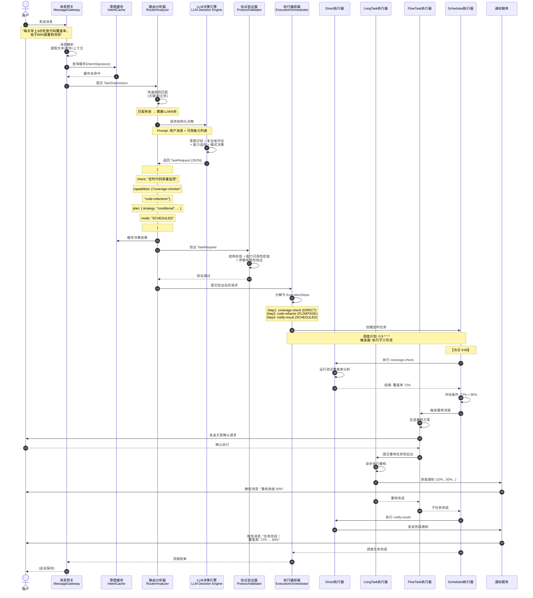
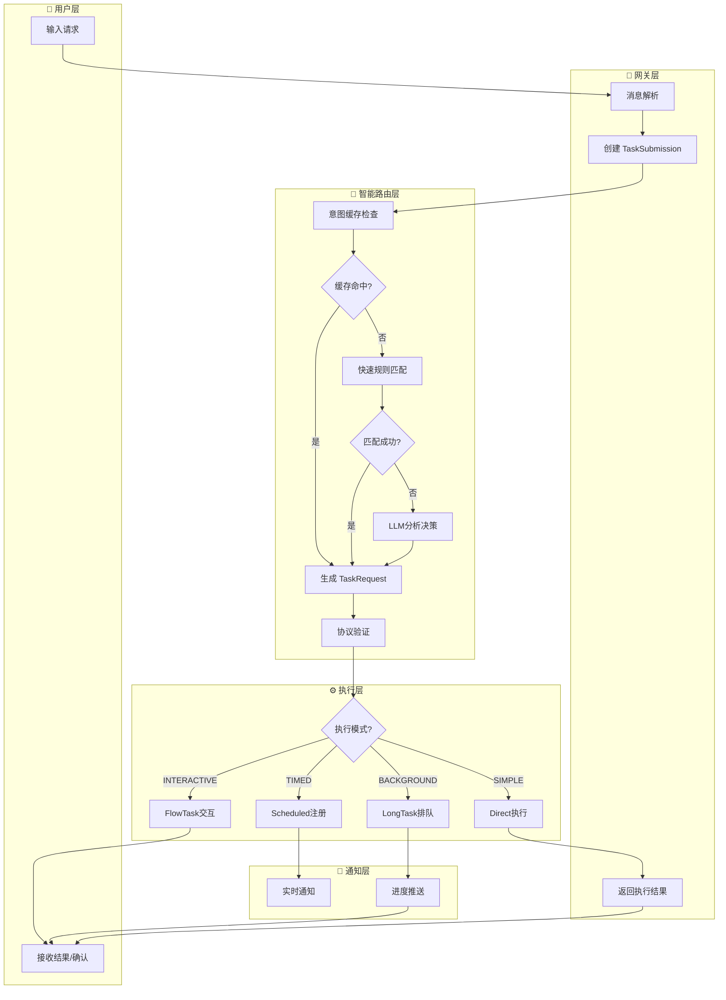
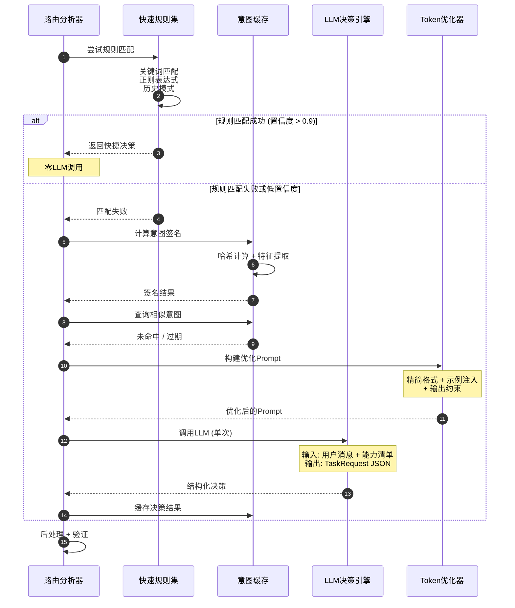
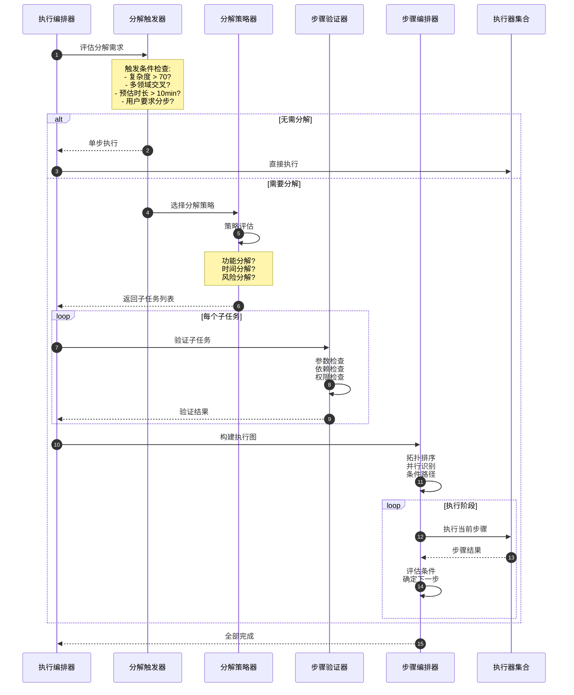
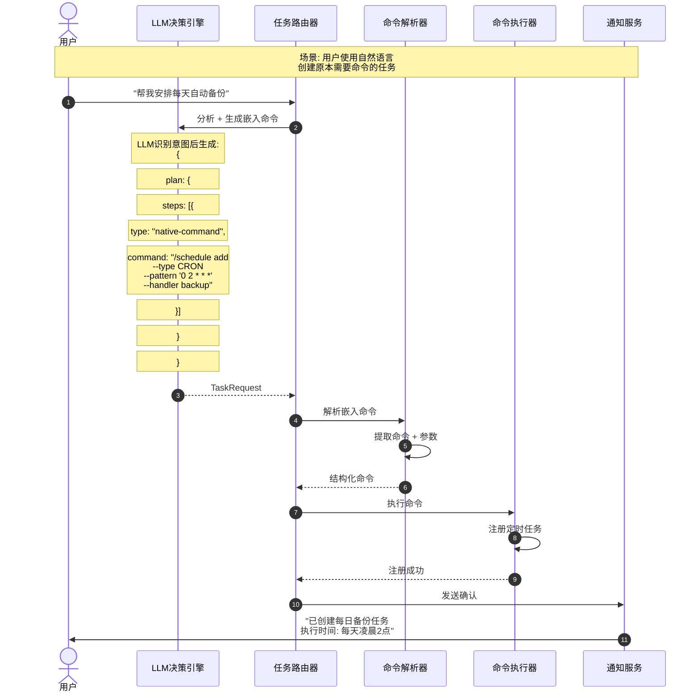
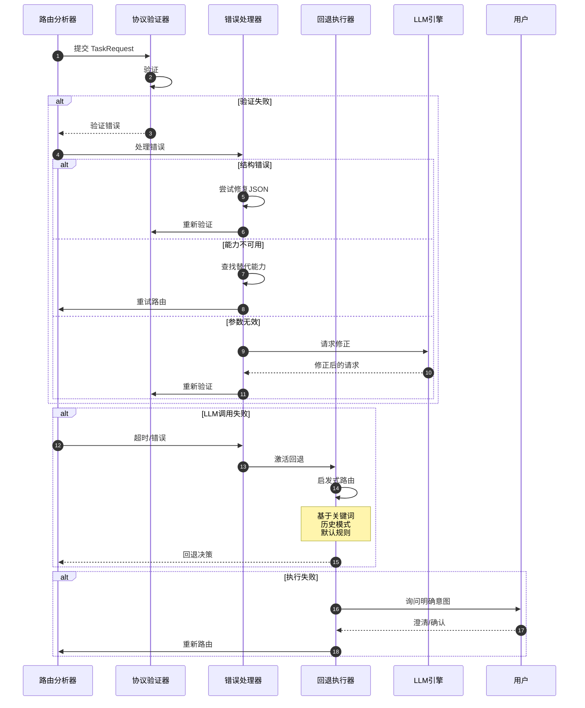
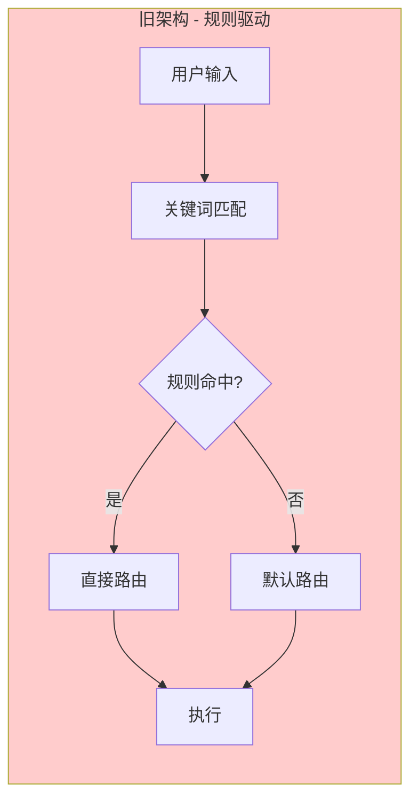
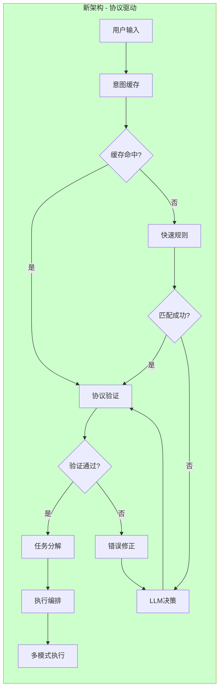

# 智能任务路由 - 泳道图

基于 Capability Protocol 的任务处理全流程可视化

## 1. 主流程泳道图

## 2. 简化的路由决策泳道图

## 3. LLM决策详细流程

## 4. 任务分解与编排泳道图

## 5. 命令嵌入模式泳道图

## 6. 错误处理与降级泳道图

## 7. 泳道图对比：旧 vs 新架构

### 旧架构（基于规则）

### 新架构（基于协议）

## 8. 时序对比

| 场景 | 旧架构 | 新架构 | 说明 |
|------|--------|--------|------|
| 简单问答 | 10ms | 10ms (缓存) | 缓存命中时相同 |
| 常见开发任务 | 50ms | 50ms (规则) | 规则匹配时相同 |
| 复杂任务 | 100ms (错误路由) | 500ms (LLM) | LLM开销换取准确性 |
| 首次复杂任务 | 100ms (错误) | 500ms + 缓存 | 后续相同任务 10ms |
| 边界任务 | 100ms (默认) | 500ms (LLM) | 避免错误路由 |

---

*生成时间: 2026-03-31*
*版本: Capability Protocol v1.0 Draft*
